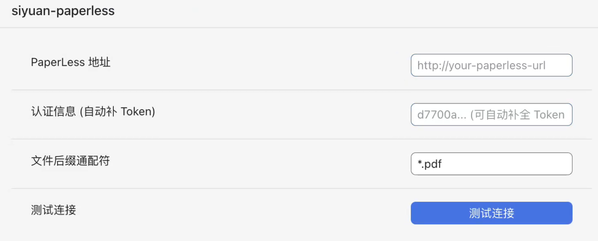

# PaperLess-Ngx Siyuan Note Plugin

[中文](https://github.com/Jasaxion/siyuan-paperless/blob/main/README_zh_CN.md)

## Introduction

[PaperLess](https://docs.paperless-ngx.com/) is an open-source, self-hosted paperless document management platform that helps you efficiently manage all your documents.
This plugin allows you to easily upload resource files from SiYuan Note to your PaperLess server.

## How to Use

1. Download and activate the plugin.

2. Open the plugin settings menu:
   

3. Enter your PaperLess server address, authentication token, and the file suffixes to be included for upload.

4. Click "Test Connection" to check if the server can be connected successfully.

## Features

1. Automatically incrementally upload document resources to the PaperLess server;
2. Manually upload individual resources to PaperLess by right-clicking on the file;
3. PaperLess server handles documents automatically (including metadata indexing, tagging, OCR, etc.—ensure proper configuration on the PaperLess side).

If you find this plugin helpful, consider giving it a ⭐️ on GitHub. Thanks!
